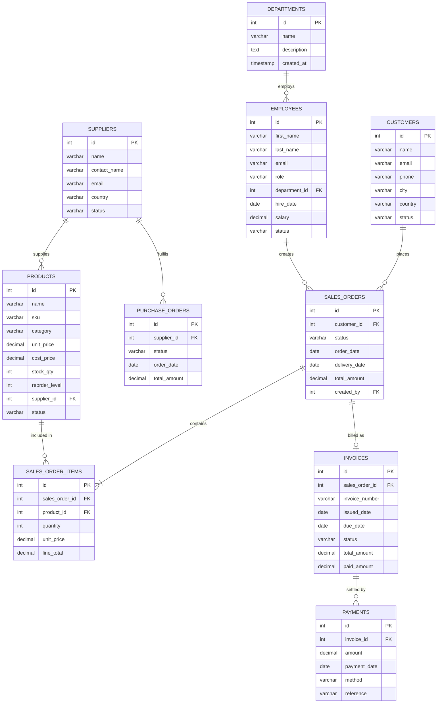

# ManuERP — Manufacturing ERP System

Ein Full-Stack Manufacturing-ERP-System, das als Lernprojekt entwickelt wurde. Es deckt den gesamten Webentwicklungs-Stack ab: relationale Datenbank, REST-API-Backend und ein React-Frontend.

# Wie es aussieht

Eine dunkle, industrielle Benutzeroberfläche. Seitennavigation mit 9 Modulen, Live-Datentabellen, modalen Formularen und einem Echtzeit-Dashboard.

# Projektstruktur

```
ERP/
├── erp-backend/         ← Java Spring Boot REST API
├── erp-frontend/        ← React + Vite Frontend
└── erp_schema_mysql.sql ← MySQL-Datenbankschema + Testdaten
```

---

# Technologie-Stack

| Ebene       | Technologie                                      |
|-------------|--------------------------------------------------|
| Datenbank   | MySQL 8.0+                                       |
| Backend     | Java 21, Spring Boot 3.2, Spring Data JPA        |
| Build-Tool  | Maven                                            |
| Frontend    | React 18, Vite, React Router                     |
| Styling     | Reines CSS (eigenes Design-System)               |
| HTTP-Client | Axios                                            |
| Icons       | Lucide React                                     |

---

# Module

| Modul | Beschreibung |
|---|---|
| **Dashboard** | Live-Statistiken, aktuelle Bestellungen, Niedrigbestand-Warnungen, offene Rechnungen |
| **Verkaufsaufträge** | Aufträge mit Positionen erstellen und verwalten, Status-Pipeline |
| **Kunden** | CRM — vollständiges Kundenverzeichnis mit CRUD-Funktionen |
| **Rechnungen** | Rechnungen automatisch aus Aufträgen generieren, Zahlungsstatus verfolgen |
| **Zahlungen** | Alle Zahlungsvorgänge erfassen und einsehen |
| **Produkte** | Inventarkatalog mit Lagerbeständen und Niedrigbestand-Warnungen |
| **Lieferanten** | Lieferantenverzeichnis |
| **Mitarbeiter** | HR-Verzeichnis mit Abteilungsgruppierung |
| **Abteilungen** | Abteilungsverwaltung |

---

# Erste Schritte

## Voraussetzungen

- Java 21
- IntelliJ IDEA (Maven bereits integriert)
- MySQL 8.0+
- Node.js LTS
---

### 1. Datenbank einrichten

MySQL Workbench öffnen und das komplette Skript ausführen:

```sql
-- Diese Datei in MySQL Workbench ausführen
erp_schema_mysql.sql
```

Dadurch wird die Datenbank `manufacturing_erp` mit allen 10 Tabellen und Testdaten erstellt.

---

### 2. Backend konfigurieren

Die Datei `erp-backend/src/main/resources/application.properties` bearbeiten:

```properties
spring.datasource.url=jdbc:mysql://localhost:3306/manufacturing_erp?useSSL=false&serverTimezone=UTC
spring.datasource.username=root
spring.datasource.password=DEIN_MYSQL_PASSWORT_HIER
```

---

### 3. Backend starten

`erp-backend` in IntelliJ IDEA öffnen und auf **Run** klicken, oder im Terminal:

```bash
cd erp-backend
mvn spring-boot:run
```

Backend läuft unter: **http://localhost:8080**

---

### 4. Frontend starten

```bash
cd erp-frontend
npm install
npm run dev
```

Frontend läuft unter: **http://localhost:5173**

> Das Frontend leitet alle `/api`-Anfragen automatisch an `localhost:8080` weiter — keine CORS-Konfiguration notwendig.

---

##  API-Endpunkte

| Modul | Basis-URL |
|---|---|
| Abteilungen | `GET/POST /api/departments` |
| Mitarbeiter | `GET/POST /api/employees` |
| Kunden | `GET/POST /api/customers` |
| Lieferanten | `GET/POST /api/suppliers` |
| Produkte | `GET/POST /api/products` |
| Verkaufsaufträge | `GET/POST /api/sales-orders` |
| Rechnungen | `GET/POST /api/invoices` |
| Zahlungen | `GET/POST /api/payments` |

Alle Ressourcen unterstützen `GET /{id}`, `PUT /{id}`, `DELETE /{id}`.

---

##  Datenbankschema



---

### Erklärung der Beziehungssymbole

| Symbol | Bedeutung | Beispiel |
|---|---|---|
| `\|\|--o{` | Ein-zu-Viele (optional) | Eine Abteilung hat viele Mitarbeiter, aber ein Mitarbeiter kann auch ohne Abteilung existieren |
| `\|\|--\|{` | Ein-zu-Viele (obligatorisch) | Ein Verkaufsauftrag muss mindestens eine Position enthalten |
| `\|\|--o\|` | Ein-zu-Eins (optional) | Ein Verkaufsauftrag kann eine Rechnung haben — muss aber nicht |

**Schlüsselkürzel in den Tabellen:**
- `PK` — Primary Key (Primärschlüssel): eindeutiger Bezeichner jeder Zeile, wird automatisch generiert
- `FK` — Foreign Key (Fremdschlüssel): verweist auf den Primärschlüssel einer anderen Tabelle und stellt die Verbindung zwischen Tabellen her

**Beziehungen auf einen Blick:**
- Eine **Abteilung** beschäftigt viele **Mitarbeiter**
- Ein **Kunde** gibt viele **Verkaufsaufträge** auf
- Ein **Mitarbeiter** erstellt viele **Verkaufsaufträge**
- Ein **Lieferant** beliefert viele **Produkte**
- Ein **Lieferant** erhält viele **Bestellungen**
- Ein **Verkaufsauftrag** enthält mindestens eine **Auftragsposition**
- Ein **Produkt** kann in vielen **Auftragspositionen** vorkommen
- Ein **Verkaufsauftrag** wird als eine **Rechnung** abgerechnet
- Eine **Rechnung** wird durch viele **Zahlungen** beglichen

---

##  Backend-Dateistruktur

```
src/main/java/com/erp/
├── ManufacturingErpApplication.java   ← Einstiegspunkt
├── config/
│   ├── CorsConfig.java                ← Erlaubt dem Frontend die Kommunikation mit dem Backend
│   └── GlobalExceptionHandler.java    ← Zentrale Fehlerbehandlung
├── model/          ← JPA-Entitäten (Abbildung auf Datenbanktabellen)
├── repository/     ← Datenbankabfrage-Interfaces
├── service/        ← Geschäftslogik-Interfaces
│   └── impl/       ← Implementierungen der Geschäftslogik
├── dto/
│   ├── request/    ← Was das Frontend sendet
│   └── response/   ← Was das Backend zurücksendet
└── controller/     ← REST-API-Endpunkte
```

---

##  Frontend-Dateistruktur

```
src/
├── App.jsx              ← Router + Layout-Gerüst
├── index.css            ← Vollständiges Design-System (Farben, Typografie, Komponenten)
├── api/
│   └── index.js         ← Alle Axios HTTP-Aufrufe an einem Ort
├── components/
│   ├── Sidebar.jsx      ← Navigations-Sidebar
│   ├── Modal.jsx        ← Wiederverwendbares modales Fenster
│   └── Badge.jsx        ← Farbkodierte Statusbezeichnungen
└── pages/
    ├── Dashboard.jsx
    ├── Customers.jsx
    ├── Products.jsx
    ├── Employees.jsx
    ├── Suppliers.jsx
    ├── Departments.jsx
    ├── SalesOrders.jsx
    ├── Invoices.jsx
    └── Payments.jsx
```


